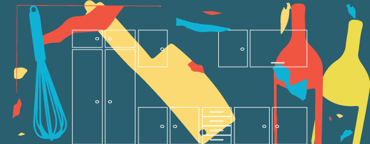

<html>
   <head>

<meta name="viewport" content="width=device-width, initial-scale=1">
     

<body>
<html>
<head>
  <meta charset="utf-8">
  <meta name="viewport" content="width=device-width">
  <title>JS Bin</title>
</head>
<body>

  

    <h1>Lorem</h1>

  

      

        

        

    

    

      <ul class="nav navbar-nav navbar-right">
        <li><a href="#header" class="smoothScroll">Home</a></li>
        <li><a href="#contents" class="smoothScroll">Features</a></li>
        <li><a href="#about" class="smoothScroll">About</a></li>
        </ul>  
  

      

      

    

      

        <h2>WHY EAT IN?</h2>
        <h4>Eat in</h4>
      

      

          

              

              <h3>SPECIAL DISH</h3>
                
 blahhhhh

              

            

              <h3> DISH</h3>
              
 blakkahkdjkhsd

              

              

              <h3>DINNER</h3>
                
info

              

          

<section id="about" class="parallax-section" style="background-position: 50% 146px;">
	

		

      

            <h2>Our Story</h2>
            <h4>The Kicthen  The Heart Of The Home</br</h4>
          

      

        

        

          
          <h3>Nunc ullamcorper suscipit neque, ac malesuada purus molestie non.</h3>
        

</body>
</html>
